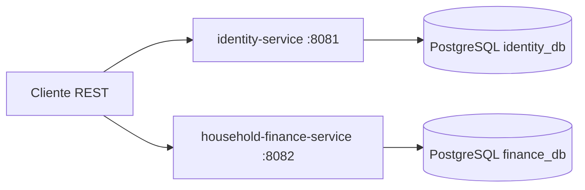

# Household Finance Platform

Backend modular para la administración de las finanzas de un hogar. El repositorio
contiene actualmente dos servicios ejecutables: `identity-service` y
`household-finance-service`.

> **Estado actual:** MVP en desarrollo. Java 21 y Spring Boot 3.3.5 se mantienen
> deliberadamente porque son las versiones configuradas por el proyecto actual.
> No se han actualizado a Java 25 ni a Spring Boot 4.x.

## Arquitectura actual

Cada servicio sigue una separación hexagonal:

```text
service/
├── domain       # Agregados, value objects y reglas sin Spring/JPA
├── application  # Casos de uso y puertos
├── adapters     # REST, seguridad y persistencia
└── bootstrap    # Aplicación Spring Boot y configuración
```



Identity persiste usuarios y refresh tokens mediante Spring Data JPA y Flyway.
Finance persiste actualmente en PostgreSQL hogares, miembros, cuentas,
categorías, tarjetas, movimientos, facturas, vencimientos y presupuestos
mediante un adaptador JPA. Los BFF todavía no están implementados.

## Módulos

- `identity-service/identity-domain`
- `identity-service/identity-application`
- `identity-service/identity-adapters`
- `identity-service/identity-bootstrap`
- `household-finance-service/finance-domain`
- `household-finance-service/finance-application`
- `household-finance-service/finance-adapters`
- `household-finance-service/finance-bootstrap`
- `architecture-tests`

Los directorios `web-bff` y `mobile-bff` están reservados para la siguiente
etapa y todavía no forman parte del reactor Maven ni de Docker Compose.

## Tecnologías configuradas

- Java 21
- Spring Boot 3.3.5
- Maven Wrapper
- Spring MVC, Spring Data JPA y Spring Security
- PostgreSQL 16
- Flyway
- JWT con JJWT
- Bean Validation
- JUnit 5, Mockito, ArchUnit y Testcontainers
- Actuator y Micrometer Prometheus
- Docker Compose

## Ejecución local

Requisitos:

- JDK 21 o superior compatible con `maven.compiler.release`
- Docker Desktop para PostgreSQL y pruebas Testcontainers

Desde `household-finance-platform`:

```powershell
Copy-Item .env.example .env
.\mvnw.cmd clean verify
docker compose up --build
```

Servicios:

| Servicio | URL |
|---|---|
| Identity | http://localhost:8081 |
| Finance | http://localhost:8082 |
| Identity OpenAPI | http://localhost:8081/swagger-ui.html |
| Finance OpenAPI | http://localhost:8082/swagger-ui.html |
| PostgreSQL | localhost:5432 |

Para iniciar herramientas opcionales:

```powershell
docker compose --profile admin-tools --profile observability up --build
```

Para detener sin borrar datos:

```powershell
docker compose down
```

Para detener y borrar los volúmenes:

```powershell
docker compose down -v
```

## Configuración

Copiar `.env.example` a `.env` y cambiar al menos:

- `POSTGRES_SUPERUSER_PASSWORD`
- `IDENTITY_DB_PASSWORD`
- `FINANCE_DB_PASSWORD`
- `JWT_SECRET`

El script `docker/postgres-init/01-init-databases.sql` crea las bases y
usuarios independientes. Los servicios no realizan consultas cruzadas entre
bases.

## API disponible

### Identity

- `POST /api/v1/auth/register`
- `POST /api/v1/auth/login`
- `POST /api/v1/auth/refresh`
- `POST /api/v1/auth/logout`
- `GET /api/v1/users/me`
- `PUT /api/v1/users/me/password`

### Finance

- `POST /api/v1/households`
- `GET /api/v1/households/{id}`
- `POST /api/v1/households/{id}/accounts`
- `GET /api/v1/households/{id}/accounts`
- `POST /api/v1/households/{id}/transactions`
- `GET /api/v1/households/{id}/transactions`
- `POST /api/v1/households/{id}/transfers`
- `POST /api/v1/households/{id}/cards`
- `POST /api/v1/households/{id}/categories`
- `POST /api/v1/households/{id}/bills`
- `POST /api/v1/households/{id}/bills/{billId}/occurrences`
- `POST /api/v1/households/{id}/bill-occurrences/{occurrenceId}/payments`
- `POST /api/v1/households/{id}/budgets`
- `GET /api/v1/households/{id}/reports/summary`

El cuerpo de pago de un vencimiento es:

```json
{
  "accountId": "<uuid-de-la-cuenta>",
  "description": "Pago de electricidad"
}
```

La petición debe incluir `Idempotency-Key`. La clave es única por usuario y
operación; repetirla con el mismo contenido devuelve el vencimiento ya pagado,
mientras que reutilizarla con contenido diferente es rechazado.

La respuesta contiene `paidBy`, que identifica el movimiento
`BILL_PAYMENT` creado por el servicio.

La lista exacta de cuerpos y ejemplos está en la colección de Postman bajo
`postman/household-finance-platform.postman_collection.json`. El procedimiento
ordenado para levantar el sistema y probarlo está en
[`docs/manual-uso.md`](docs/manual-uso.md), y los datos generados se detallan
en [`docs/postman-datos-de-prueba.md`](docs/postman-datos-de-prueba.md).

## Persistencia financiera

El puerto `FinanceRepository` es implementado por
`FinanceRepositoryAdapter`, que utiliza Spring Data JPA y PostgreSQL para:

- hogares y miembros;
- cuentas financieras con control de versión;
- tarjetas de crédito;
- categorías;
- transacciones.
- facturas y vencimientos;
- presupuestos, incluyendo período, límite y consumo.

La migración inicial está en
`household-finance-service/finance-bootstrap/src/main/resources/db/migration/V1__finance_schema.sql`
(incluye la columna `billing_day` de tarjetas de crédito, antes ausente del
esquema aunque el dominio y el adaptador ya la usaban). El dominio no conoce
las entidades JPA; el adaptador realiza el mapeo entre ambos modelos.

Los casos de uso de ingresos, gastos y transferencias (`TransactionService`)
se ejecutan dentro de una transacción de aplicación (`@Transactional`) y leen
las cuentas afectadas mediante `FinanceRepository#lockAccount`, que aplica
bloqueo pesimista (`PESSIMISTIC_WRITE`) sobre la fila de `financial_accounts`.
En las transferencias ambas cuentas se bloquean en un orden determinista por
UUID para evitar interbloqueos. Esto asegura que movimientos concurrentes
sobre la misma cuenta se serialicen a nivel de base de datos y no se pierdan
actualizaciones de saldo. Una prueba de integración (`FinancePersistenceAdaptersIT`,
ver sección de pruebas) ejercita transferencias concurrentes reales para
validar este comportamiento.
Las operaciones de creación de facturas, generación de vencimientos, pago de
vencimientos y creación de presupuestos se ejecutan dentro de transacciones de
Spring. El pago de un vencimiento recibe el `accountId` de la cuenta que se
utilizará, bloquea esa cuenta con `PESSIMISTIC_WRITE`, crea un movimiento
`BILL_PAYMENT`, descuenta el saldo y marca el vencimiento como `PAID` dentro de
la misma transacción. Si la cuenta no tiene saldo suficiente, la moneda no
coincide, la cuenta pertenece a otro hogar o el vencimiento ya fue pagado, la
operación falla sin dejar cambios parciales. El identificador del movimiento
creado queda asociado al vencimiento en `paidBy`.

Los vencimientos se guardan con una restricción única por factura y fecha, y el
adaptador reconstruye sus identificadores y estados (`PENDING`, `PAID`,
`CANCELLED` u `OVERDUE`) desde PostgreSQL. La idempotencia persistente está
implementada para pagos de vencimientos: la tabla `idempotency_keys` conserva
la clave, el hash de la solicitud, su estado y el recurso generado.
Transferencias y otros movimientos todavía no utilizan esta protección; el
outbox y los pagos parciales siguen pendientes.

## Seguridad y observabilidad

- JWT stateless con validación de firma, issuer y audience.
- Contraseñas con BCrypt.
- Refresh tokens almacenados como hash y rotados.
- Autorización de pertenencia al hogar en la capa de aplicación.
- Correlation ID en las peticiones de Identity.
- Actuator limitado a health, info y Prometheus.
- Health checks de liveness en Docker Compose.

Todavía faltan rate limiting específico para login/refresh, OpenTelemetry
Collector, trazabilidad distribuida y BFF independientes.

## Pruebas

Pruebas unitarias y de arquitectura:

```powershell
.\mvnw.cmd test
```

Verificación completa, incluyendo integración:

```powershell
.\mvnw.cmd clean verify
```

Las pruebas Testcontainers requieren que Docker Desktop esté iniciado.
`identity-adapters` (`PersistenceAdaptersIT`) y `finance-adapters`
(`FinancePersistenceAdaptersIT`) levantan PostgreSQL real vía Testcontainers y
corren en la fase `verify` (Failsafe), no en `test` (Surefire). La prueba de
finanzas cubre el mapeo dominio-JPA de hogares/miembros, cuentas, categorías,
tarjetas y transacciones, además de un escenario de transferencias
concurrentes que valida el bloqueo pesimista de cuentas.

> **Bloqueo conocido en este entorno:** al ejecutar `.\mvnw.cmd verify` en la
> sesión de desarrollo actual, el cliente Java de Testcontainers no pudo
> completar el *handshake* inicial contra el Docker Engine API (`/info`
> devuelve `400` con un cuerpo vacío) aunque `docker version`, `docker info` y
> `docker run` por CLI funcionan correctamente y el contexto activo
> (`desktop-linux`, pipe `dockerDesktopLinuxEngine`) es válido. Se probó fijando
> `DOCKER_HOST` al pipe correcto sin éxito. Esto es compatible con un entorno
> sandbox que expone la CLI de Docker pero restringe el acceso directo al
> socket/API del daemon que usa el cliente Java de Testcontainers. Como
> resultado, `FinancePersistenceAdaptersIT` (y de forma análoga
> `PersistenceAdaptersIT` de identity) no pudieron ejecutarse en esta sesión;
> `.\mvnw.cmd test` (sin Failsafe) sí se ejecutó completo y en verde,
> incluyendo las 11 reglas de `architecture-tests`. Ejecutar `.\mvnw.cmd clean
> verify` en una máquina con Docker Desktop sin esa restricción debería correr
> ambas pruebas de integración sin cambios adicionales.

## Limitaciones conocidas y próximos pasos

1. Completar invitaciones, cambio de roles y transferencia de administración.
2. Completar reversas, estados de cuenta, reportes por categoría y consumo de presupuestos.
3. Añadir idempotencia persistente mediante `Idempotency-Key` para transferencias y movimientos.
4. Crear `web-bff` y `mobile-bff`.
5. Completar OpenAPI, RFC 9457 uniforme y pruebas de integración REST.
6. Añadir rate limiting, auditoría y OpenTelemetry.
7. Incorporar `.dockerignore`, ADR y pipeline de CI.

## Documentación adicional

- `docs/modelo-datos-mvp.md`: modelo de datos y límites del MVP.
- `docs/postman-datos-de-prueba.md`: datos de prueba para Postman.
- `docs/manual-uso.md`: manual de ejecución, flujo recomendado y pruebas.
- `docs/postman-manual.md`: instrucciones específicas para importar y ejecutar
  la colección en Postman o Newman.
- `docs/postman-flujos-prueba.md`: flujos funcionales, resultados esperados y
  matriz de pruebas manuales.
- `postman/household-finance-platform.postman_collection.json`: colección
  Postman 2.1 importable.
- `postman/household-finance-platform.postman_environment.json`: entorno local
  de Postman.
- `compose.prod.yaml`: configuración de referencia para un entorno más restrictivo.
