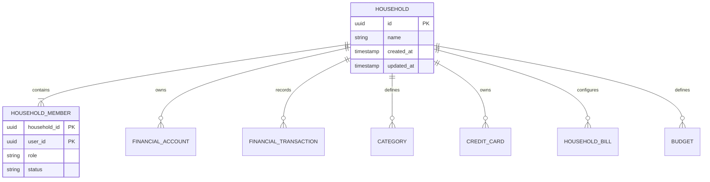
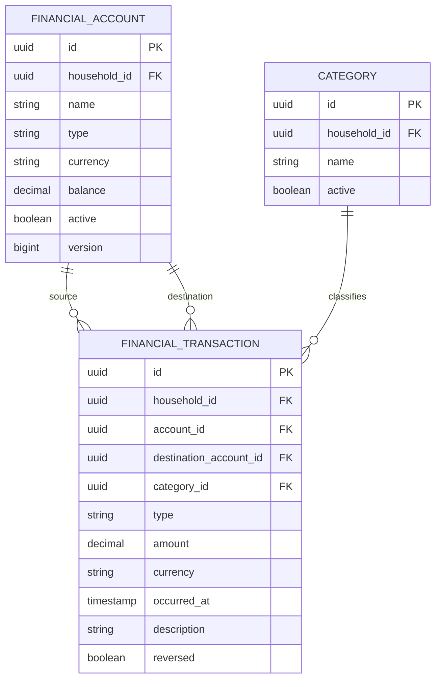

# Modelo de datos del MVP

## Alcance

El MVP contiene dos bounded contexts desplegables:

- **Identity**: usuarios, credenciales y refresh tokens.
- **Household Finance**: hogares, miembros, cuentas, movimientos, categorías, tarjetas, facturas, vencimientos y presupuestos.

Cada servicio es propietario de sus datos. En el entorno local se utiliza una instancia PostgreSQL con bases separadas (`identity_db` y `finance_db`). No existen claves foráneas ni consultas entre bases de servicios.

## Identidad

El agregado `User` contiene:

| Campo | Descripción |
|---|---|
| `id` | UUID público del usuario |
| `email` | Correo único normalizado |
| `passwordHash` | Hash BCrypt; nunca se almacena la contraseña |
| `firstName`, `lastName` | Datos básicos |
| `status` | Estado del usuario |
| `createdAt`, `updatedAt` | Fechas UTC |

Los refresh tokens se identifican mediante UUID y se almacenan de forma segura (el valor presentado al cliente no se guarda en texto plano). La renovación rota el token anterior.

## Finanzas del hogar

### Household y miembros

`Household` es el agregado raíz. Su identificador es UUID y contiene una colección de `HouseholdMember`.

El creador se convierte en administrador. Los roles actuales son `ADMIN`, `MEMBER` y `VIEWER`. La autorización se valida en la capa de aplicación, comprobando que el JWT pertenece a un miembro activo.

### Cuentas y movimientos

Una `FinancialAccount` pertenece a un hogar y tiene moneda, tipo y saldo. El saldo solo cambia mediante operaciones de dominio (`credit` y `debit`), nunca mediante un endpoint genérico de actualización.

Tipos actuales: `CASH`, `BANK`, `INVESTMENT` y `OTHER`.

`Transaction` registra ingresos, gastos, transferencias y reversas. El monto es un `BigDecimal` asociado a una moneda ISO-4217. El MVP usa `INCOME`, `EXPENSE`, `TRANSFER` y `REVERSAL`.

### Facturas y vencimientos

`HouseholdBill` representa la configuración de una cuenta recurrente, por ejemplo electricidad. `BillOccurrence` representa un vencimiento concreto. Un vencimiento pagado guarda el `transactionId` que lo respalda y no puede pagarse dos veces.

### Tarjetas y presupuestos

`CreditCard` mantiene el límite y el saldo pendiente sin almacenar número completo ni CVV. `Budget` asocia una categoría con un límite monetario y un período (`MONTHLY`, `YEARLY` o `CUSTOM`).

## Persistencia actual y evolución

Las migraciones Flyway definen las tablas PostgreSQL, índices, restricciones de monto positivo, unicidad de categorías y unicidad de vencimientos por factura/fecha. Durante el MVP, el adaptador principal de Finance utiliza un repositorio en memoria para facilitar la evolución de casos de uso. El siguiente paso de producción es conectar el puerto `FinanceRepository` al adaptador JPA existente y conservar exactamente estos agregados y contratos.

## Flujo de datos de una operación

1. El cliente obtiene un JWT desde Identity.
2. Envía el JWT al endpoint de Finance.
3. Finance valida firma, issuer y audience.
4. El caso de uso verifica pertenencia al hogar.
5. El agregado valida monto, moneda, saldo y reglas de negocio.
6. El puerto de persistencia guarda el agregado y el movimiento.
7. El reporte calcula ingresos, egresos y balance sobre movimientos del período.
